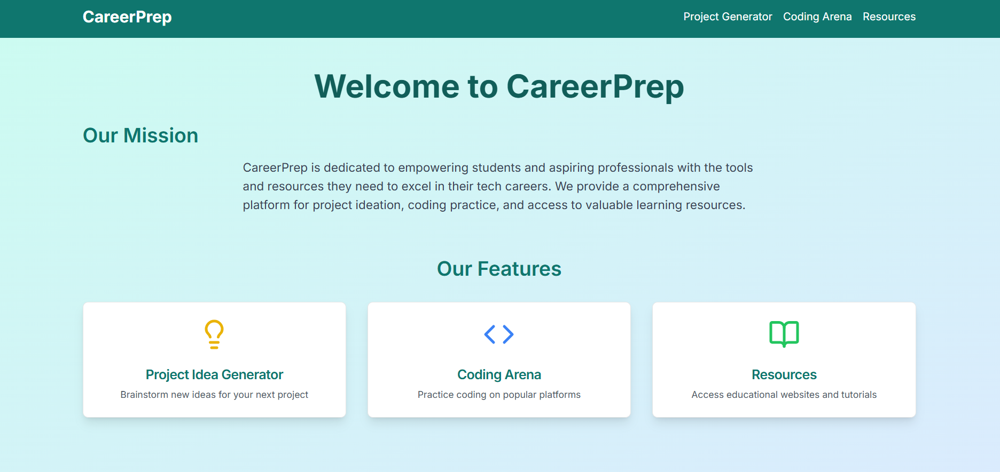

# CareerPrep

CareerPrep is a comprehensive web application designed to empower students and aspiring professionals in their tech careers. It provides tools for project ideation, coding practice resources, and access to valuable learning materials.

## Features

1. **Project Idea Generator**: Get personalized project suggestions based on your academic background, technical skills, and interests.
2. **Coding Arena**: Access links to popular coding platforms for practice and skill enhancement.
3. **Educational Resources**: Find curated links to top educational websites for learning various technologies and concepts.

## Technologies Used

- Next.js
- React
- TypeScript
- Tailwind CSS
- shadcn/ui components
- Google Generative AI (for project idea generation)

## careerprep webpage screenshots

## video demo
<video controls src="20251028-1623-37.8025479.mp4" title="webpage UI"></video>

## To run project

npm run dev

